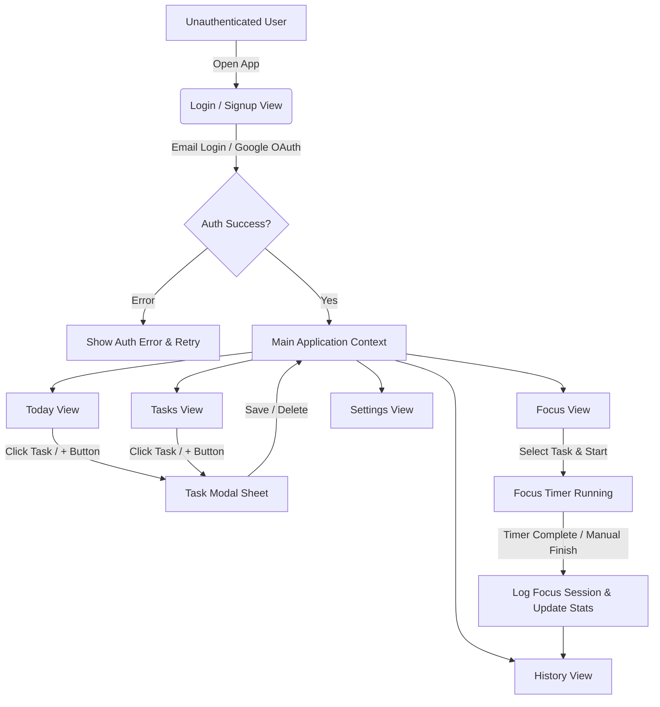

# Skyfocus — Minimum Marketable Product (MMP) Product Requirement Document (PRD)

> **Document Status**: Release Candidate
> **Version**: 1.0.0 (MMP)  
> **Source of Truth**: Active Source Code (`./src/`), Database DDL (`./supabase/migrations/`), and Specification Specs (`./docs/`)  
> **Last Updated**: 2026-07-22

---

## 1. Product Overview

**Skyfocus** is a premium, Apple-inspired Progressive Web Application (PWA) designed to seamlessly combine task management with Pomodoro focus tracking. Built with React, Vite, TypeScript, and Supabase, Skyfocus delivers a native iOS-like aesthetic with soft color tokens, rounded cards, micro-animations, and offline-resilient local state management.

### Key Value Propositions
- **Unified Productivity Workflow**: Single-app experience combining daily task organization with deep concentration timers.
- **Apple Native Design & Experience**: Floating pill bottom navigation, smooth sheet transitions, fluid progress indicators, and HSL-tailored color schemes (`#427692` background, `#F1EEDC` surface).
- **Progressive Web App (PWA)**: Full offline service worker caching, maskable app icons, standalone mobile display, and cross-platform installation.
- **Multi-Language Support (i18n)**: Out-of-the-box support for Traditional Chinese (`zh-TW`), English (`en`), and Japanese (`ja`).

---

## 2. Target Users

1. **Digital Knowledge Workers & Freelancers**: Professionals who need a lightweight, clean task planner alongside a focus timer without bloated enterprise features.
2. **Students & Self-Learners**: Individuals practicing the Pomodoro technique to maintain focus during long study blocks.
3. **Apple Ecosystem Enthusiasts**: Users who value refined typography, clean card layouts, smooth touch interactions, and distraction-free UI.
4. **Mobile & Desktop PWA Users**: Users seeking a zero-install or quick-install productivity widget across iOS, Android, and macOS/Windows.

---

## 3. User Problems

| Problem | Skyfocus Solution |
|---|---|
| **Context Switching Between Apps**: Users lose focus switching between a todo list app and a separate Pomodoro timer app. | **Integrated Focus Session**: Select any task directly from the Pomodoro focus view to track time against it. |
| **Overwhelming & Cluttered UIs**: Traditional task apps overcrowd the screen with complex project boards and nested menus. | **Minimalist 5-Tab Navigation**: Clean division into Today, Tasks, Focus, History, and Settings. |
| **Poor Mobile Web Experience**: Non-native web apps lag, lack safe-area padding, and fail as installed PWAs. | **iOS Safe-Area Aware PWA**: Viewport-fit cover, auto-updating Service Worker, maskable icons, and smooth touch response. |
| **Network Instability**: Cloud-only apps block users when internet connectivity drops. | **Graceful Offline Handling**: The app shell remains cacheable and data errors are surfaced without creating fake records. |

---

## 4. Product Goals

1. **Production-Ready Quality**: 100% build pass without TypeScript errors, complete PWA asset generation, and clean Vercel deployment.
2. **Fast Load Times & Performance**: Bundle code-splitting with vendor chunking under 4.5s initial build time.
3. **End-to-End Authentication**: Support for Email/Password registration & login, Google OAuth integration, password reset, and automatic profile generation.
4. **Complete Data Persistence**: Relational Supabase schema covering profiles, tasks, subtasks, tags, lists, reminders, and focus sessions with strict Row Level Security (RLS).

---

## 5. Complete Feature List

### 5.1 Authentication & User Management (`LoginView.tsx`, `AuthContext.tsx`)
- **Email/Password Auth**: Registration with display name, sign-in, and password reset trigger.
- **Google OAuth Integration**: One-click Google sign-in with automatic redirect back to application origin.
- **Supabase Error Handling**: Connection failures are surfaced to the user; no fake users or local production records are created.
- **User Profile Management**: Display name editing, profile avatar initial generation, and language preferences.

### 5.2 Daily Overview (`TodayView.tsx`)
- **Time-Aware Greeting**: Dynamic morning, afternoon, or evening greeting with user display name.
- **SVG Circular Progress Ring**: Live calculation and visual feedback of completed vs. total today's tasks.
- **Today's Task Feed**: Filtered view displaying tasks due today or created today, sorted by completion status and priority.
- **Quick-Add Action**: Floating action button to launch task creation modal instantly.

### 5.3 Task & List Management (`TasksView.tsx`, `TaskModal.tsx`, `TaskContext.tsx`)
- **Task CRUD**: Create, view, edit, and delete tasks with title, description, priority (`low`, `medium`, `high`), due date, and due time.
- **Subtasks**: Add, toggle, and remove checklist items within tasks.
- **Lists & Tags**: Custom task list categories and color-coded tag associations.
- **Filter & Search**: Real-time keyword search across task titles and descriptions, alongside completion/list filters.
- **Sorting Options**: Sort by due date, priority level, or creation time.

### 5.4 Pomodoro Focus Timer (`FocusView.tsx`, `FocusContext.tsx`)
- **Work & Break Modes**: Preset concentration blocks with interactive mode toggling.
- **Duration Customization**: On-screen duration editor (Work: ±5 min, Break: ±1 min).
- **Interactive Controls**: Start, Pause, Resume, Reset, and Force Complete timer controls.
- **Task Linkage**: Dropdown selector to link current focus session to any pending task.
- **Focus Streak & Daily Stats**: Real-time summary of today's completed focus sessions and total focus minutes.

### 5.5 History & Analytics (`HistoryView.tsx`)
- **Tabbed History View**: Switch between completed tasks log and completed focus session logs.
- **Session Duration Tracking**: Exact records of past focus session durations, completion dates, and linked task names.
- **Empty State Illustrations**: Clean, Apple-styled empty state icons and messages when no records exist.

### 5.6 Settings & Internationalization (`SettingsView.tsx`, `i18n.ts`)
- **Language Switcher**: Dynamic runtime language switching between 繁體中文, English, and 日本語.
- **Notification Permission**: Interactive browser notification permission request. Background Web Push delivery is not implemented yet.
- **iOS Settings Card Layout**: Grouped card sections matching iOS System Settings aesthetic.
- **Sign Out**: One-tap session termination and state reset.

---

## 6. User Flows



---

## 7. UI Design Principles

- **Color System**:
  - Primary App Background: `#427692` (Sky Teal)
  - Card & Sheet Surfaces: `#F1EEDC` (Warm Cream)
  - Primary Text: `#475A61` (Slate Blue)
  - Muted Text & Borders: `#68828C`
  - Accent Dark: `#2C5364`
- **Border Radius**:
  - Small Elements / Inputs: `12px`
  - Cards & Buttons: `14px` / `20px`
  - Sheets & Floating Bar: `28px`
- **Layout & Floating Bar**:
  - Floating pill navigation anchored at bottom center with `backdrop-filter: blur(12px)`.
  - Responsive safe-area padding for iPhone notch and Home Bar (`env(safe-area-inset-*)`).
- **Micro-Animations**:
  - Smooth scale transitions on active buttons (`scale(0.97)`).
  - Pop animation on checkmark completion (`checkPop`).
  - Skeleton shimmer animations during loading states.

---

## 8. Technical Architecture

```
Skyfocus Frontend (Vite + React + TypeScript + TailwindCSS)
├── src/
│   ├── components/       # Reusable Navigation & Modal Sheet UI
│   ├── context/          # AuthContext, TaskContext, FocusContext
│   ├── lib/              # Supabase Client & i18next Setup
│   ├── types/            # Database & App TypeScript Definitions
│   └── views/            # TodayView, TasksView, FocusView, HistoryView, SettingsView
├── public/               # PWA Icons & Web Manifest
├── supabase/             # DDL Migrations & RLS Policies
└── vite.config.ts        # Vite Build & VitePWA Workbox Setup
```

- **Frontend Core**: React 18, TypeScript, Vite 5.
- **Styling**: Tailwind CSS + Custom CSS Variables in `src/index.css`.
- **Icons & Dates**: `lucide-react`, `date-fns`.
- **Backend & Auth**: `@supabase/supabase-js` connecting to PostgreSQL with Row Level Security.
- **PWA Integration**: `vite-plugin-pwa` with Workbox precaching for the application shell and static assets. Private Supabase API responses are not cached.

---

## 9. Database & Security Model

Defined in `supabase/migrations/20260722000000_initial_schema.sql`:

### 9.1 Schema Tables
1. `profiles`: Extends Supabase `auth.users` (`id`, `display_name`, `avatar_url`, `language`, `timezone`).
2. `task_lists`: Categories for tasks (`id`, `user_id`, `name`, `color`, `position`).
3. `tasks`: Primary task entity (`id`, `user_id`, `list_id`, `title`, `description`, `priority`, `status`, `due_date`, `due_time`).
4. `subtasks`: Sub-items for tasks (`id`, `task_id`, `title`, `is_completed`, `position`).
5. `tags` & `task_tags`: Many-to-many tag labels for tasks.
6. `reminders`: Scheduled reminder entries (`id`, `task_id`, `reminder_time`, `repeat_type`, `enabled`).
7. `notifications`: In-app notification queue.
8. `push_subscriptions`: Web Push subscription endpoint tokens.
9. `focus_sessions`: Pomodoro session logs (`id`, `user_id`, `task_id`, `duration`, `completed`, `mode`).

### 9.2 Security & RLS Policies
- **Row Level Security (RLS)** is enabled on all tables.
- **Strict User Scoping**: Policies explicitly enforce `auth.uid() = user_id`, preventing cross-tenant data access.
- **Automatic Profile Trigger**: Database function `handle_new_user()` creates a row in `public.profiles` automatically upon sign-up.

---

## 10. Release Checklist

- [x] Database schema and RLS migration are present in the repository.
- [x] Multi-language translations (`zh-TW`, `en`, `ja`) are implemented.
- [x] PWA manifest, maskable icons, and Service Worker are generated.
- [x] Production build passes `npm run build` with zero TypeScript errors.
- [ ] Supabase production migration and RLS isolation require live-environment verification.
- [ ] Google OAuth requires live-provider verification.
- [ ] Background Web Push delivery is not implemented.

---

## 11. Future Roadmap

1. **Web Push Background Notifications**: VAPID subscription, Service Worker push handling, and a secure delivery service for scheduled reminders.
2. **Cloud Sync Status Indicator**: Real-time indicator showing online/offline sync status in bottom navigation bar.
3. **Advanced Analytics & Charts**: Weekly/monthly focus duration visual charts and productivity trends.
4. **Drag-and-Drop Task Reordering**: Interactive reordering for subtasks and list items.
